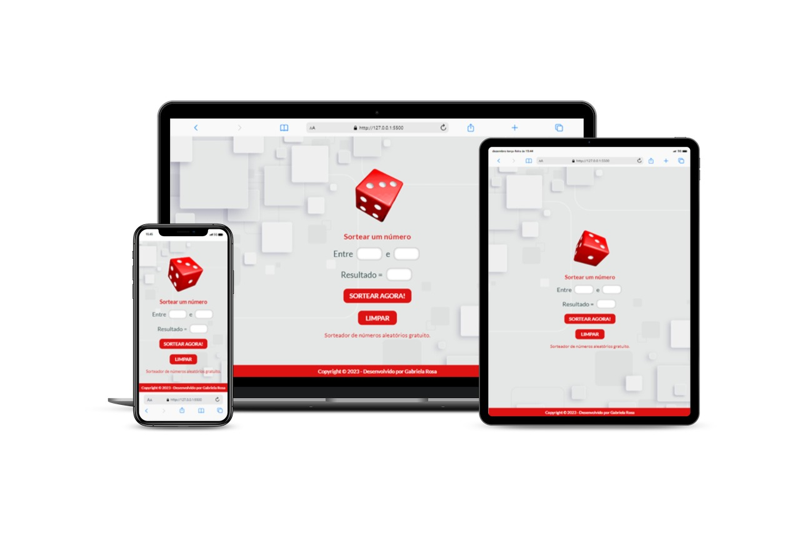

<h1 align="center">Sorteador - DevSorteio</h1>

## 📝 Sobre o projeto

Esse projeto tem como intuito realizar um sorteio online entre dois numero, apresentando rapidamente o resultado, seguindo a pratica dos conteúdos das aulas de Javascript do <a href="https://rodolfomori.com.br/devclub/">DevClub</a>. 
 
Esse projeto se adapta tanto para desktop quanto para mobile e tablet.
 
Esse sorteador funciona da seguinte forma, é necessário digitar 2 valores. Sendo que o primeira valor deve ser menor que o segundo, após isso é só clicar em "Sortear Agora" e o valor é exibido na caixa do resultado. Para sortear outros numero é só clicar novamente em "Sortear Agora".

## 💻 Tecnologias utilizadas

